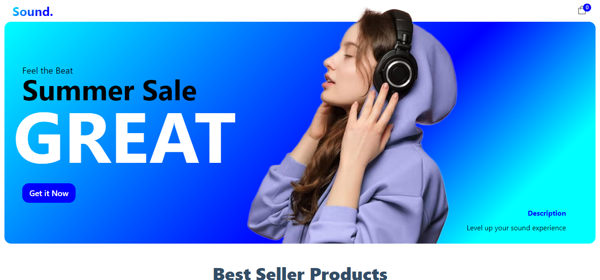
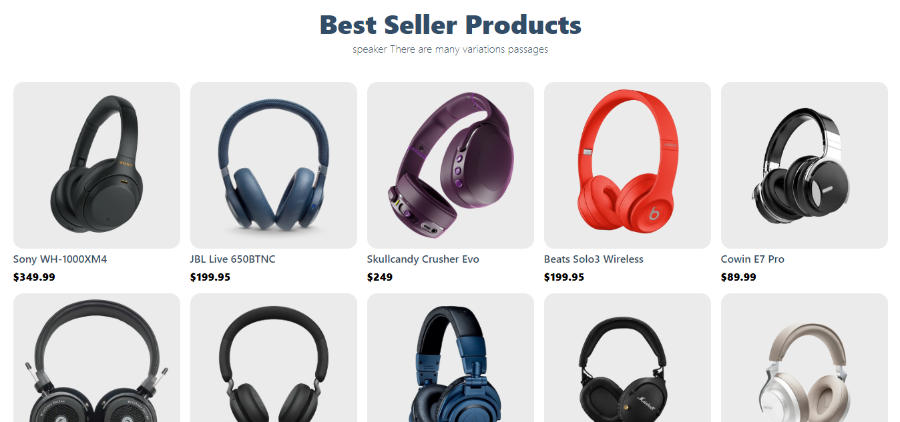
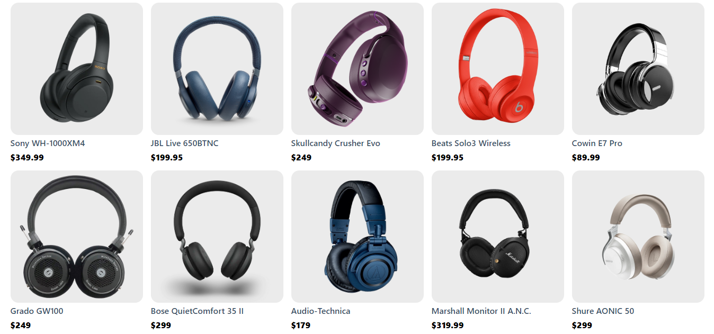
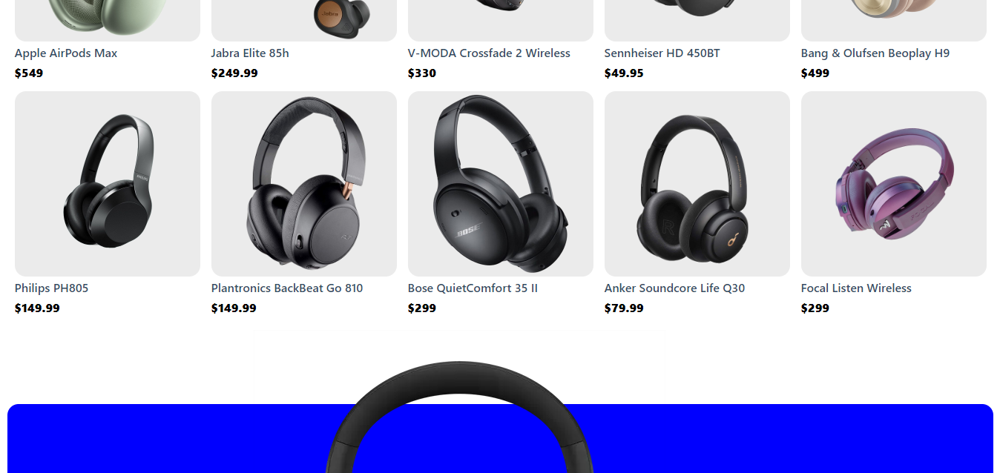
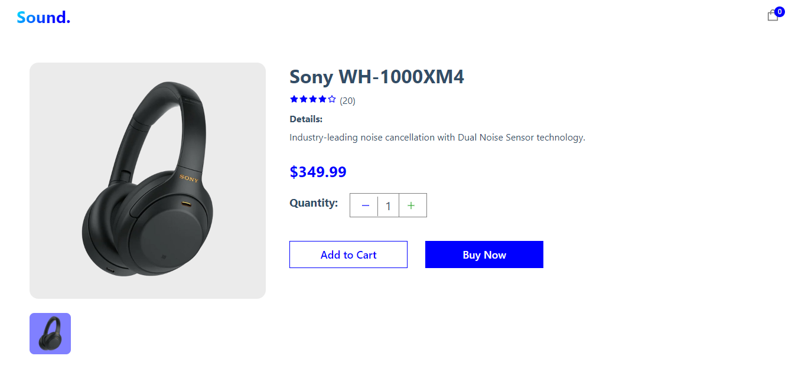
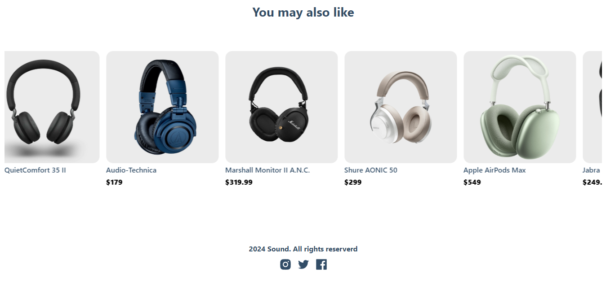
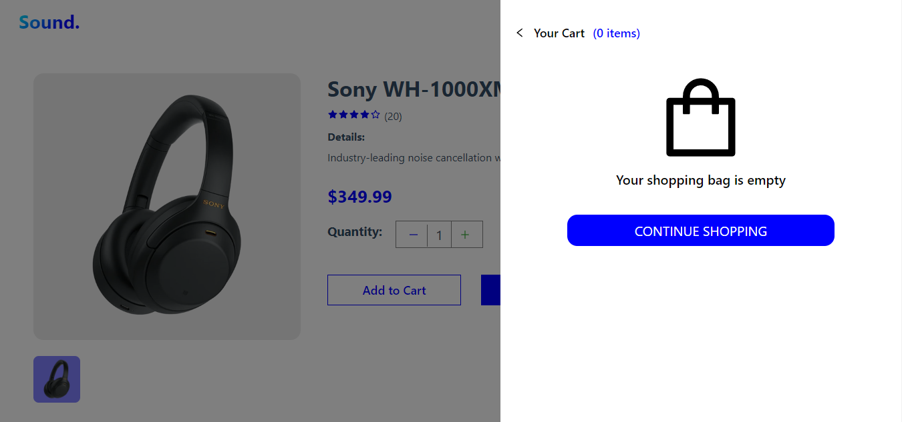
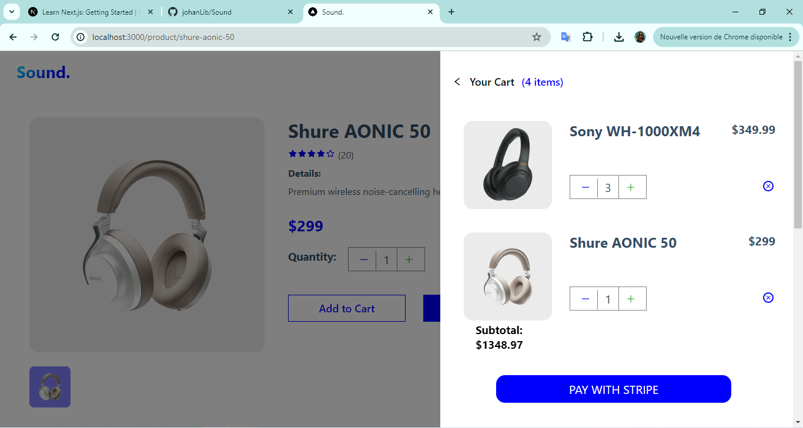

# Sound - FullStack E-commerce Application

## Overview

Sound is a dynamic fullStack e-commerce application designed specifically for headphones. This project is built using the Next.js framework for server-side rendering, Sass for styling and design, and Sanity as the headless CMS for content management.

## ScreenShots

## Features

- **Server-Side Rendering (SSR)**: Ensures fast page loads and improved SEO.
- **Dynamic Content Management**: Easily manage and update product information and content through Sanity.
- **Responsive Design**: Optimized for various devices to ensure a seamless user experience.
- **Product Listings**: Browse a variety of headphones with detailed descriptions and pricing.
- **Shopping Cart**: Add products to the cart and manage your purchases.

## Technologies

- **Next.js**: A powerful React framework for server-side rendering and static site generation.
- **Sass**: A CSS preprocessor that allows for more efficient and organized styling.
- **Sanity**: A headless CMS that provides a flexible and scalable content management solution.
